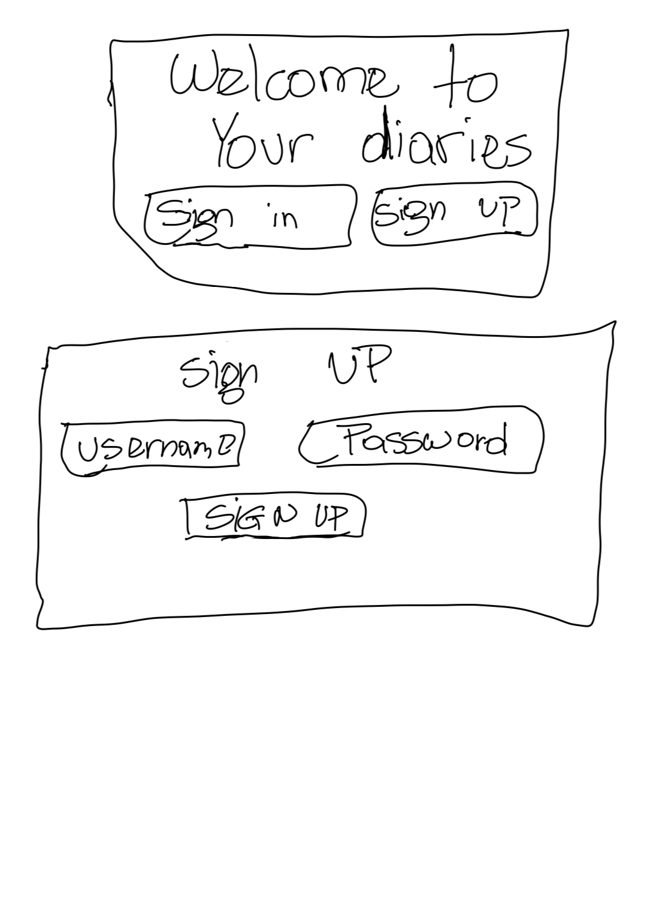
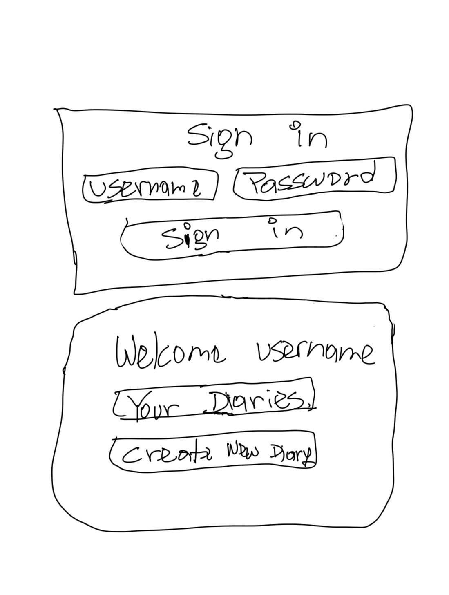
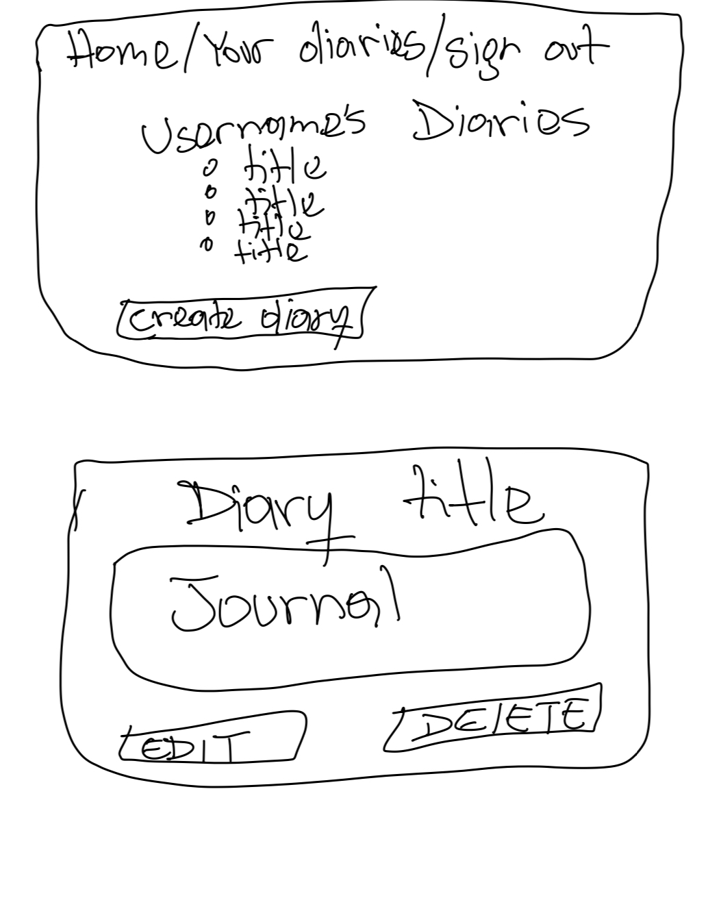

### My Diary Description

My Diary is a web application that allows users to log their daily activities. They can add events on what unfolded during theid day and can go back and review those memories whenever they wish. The user will be able to create, read, update and delete any of the diaries they've created.






### MVP
AAU I should be able to sign up and sign in to a secure web app to create diaries.
AAU I should be able to read, update and delete the diaries I have created.
AAU I should be able to sign out of my profile.


# Stretch goal 
AAU I should be able to organize my diaries into categories


# Pseudocode:
1: create a home page where users will be able to sign up and sign in to the web app
2: creata a page displaying option to create a diary  and access created diaries
3: create a page allowing users to update or delete their diaries
4: have a sign out button allowing users to exit their account 


```javascript 

const mongoose = require('mongoose');

const diarySchema = mongoose.Schema({
  title: {
    type: String,
    required: true,
  },
  journal: {
    type: String,
    required: true,
  },
  createdAt: {
    type: Date,
    default: Date.now,
  },
});

const userSchema = mongoose.Schema({
  username: {
    type: String,
    required: true,
  },
  password: {
    type: String,
    required: true,
  },
  diaries: [diarySchema], 
});


const User = mongoose.model('User', userSchema);

module.exports = User;


Routing Table Example…
| HTTP Method (Verb) | Path/Endpoint/URI     | CRUD Operation            | Route Name | Has Data Payload? | Purpose                                                                                            | Render/Redirect Action        |
| ------------------ | --------------------- | ------------------------- | ---------- | ----------------- | -------------------------------------------------------------------------------------------------- | ----------------------------- |


| GET                | `/`                   | home  page                | show       |  no                | welcome page displaying access options                                                                                            |`res.render(diaries/index.ejs)`|
| GET                |  `auth/sign-up`       | create account            | create     | no                 | creating user profile                                                                                            | `res.render(auth/sign-up.ejs)`|
| POST               |  `auth/sign-up`       | creating new account      |  create    |  no                |   create an account for users to 
acces  their account                                                                               | `res.render(auth/sign-up.ejs)`
| GET                | `auth/sign-in`        | app access                | create     | no                 | authenticating user and give eaccess to app                                                                                     | `res.render(auth/sign-in.ejs)`|
| POST               | `auth/sign-in`        |   accessing app           | update     | no                 |  accessing app after authenticating                                                                                     | `res.render(auth/sign-in.ejs)`|
| GET                | `/diaries/:userId`    | Read all _diaries_        | index      | No                 |  shows all diaries                                                                                            | `res.render('diaries/index')` |
| GET                | `/diaries/:usId/:diId`| Read a specific _diary_   | show       | No                 | Renders a view that shows a specific diary                                                                                     | `res.render('diaries/show')`  |
| GET                | `/diaries/new`        | access create diary UI    |     show   |    no              |    creating new diary page                                                                                               | `res.render('diaries/new.ejs)`|     index
| POST               | `/diaries/new`        | Create a new _diary_      | new        | No                 | Renders a view including a form the user can fill out and submit to add a new diary                                                    | `res.render('diaries/new.ejs')`|
| PUT                | `/diaries/:diaId/edit`| See note below*           | edit       | No                 | Renders a view including a filled out form the user can edit and submit to update a specific diary                                   | `res.render('diaries/edit.ejs')`|
| PUT                | `/diaries/:diaryId`   | Update a specific _diary_ | update     | Yes                | Handles the user submitting a form to update a specific blog                                                                          | `res.redirect('diaries/:diaryId')`  
| DELETE             | `/diaries/:diaryId`   | Delete a specific _diary_ | delete     | No                 | Handles the user request to delete a specific blog                                                                                    | `res.redirect('/diaries/:diaryId')` |
| GET                | `auth/sign-out`       | log out of account        | show       |                    | log off app and return to sign up and sign in page                                                                                   | `res.redirect('/')                  |       `              
    


|  Day        |   | Task                               | Blockers | Notes/ Thoughts |
| ------------|---|------------------------------------|----------|-----------------|
| Thursday    |   | Create and present proposal        |          |                 |
| Friday      |   | Create and code home ejs file      |          |                 |
| Saturday    |   | Create authentication              |          |                 |
| Sunday      |   | Create add and read files          |          |                 |
| Monday      |   | DEPLOY                             |          |                 |
| Tuesday     |   | create file updating and  Delete   |          |                 |
| Wednesday   |   | Add CSS styling                    |          |                 |
| Thursday    |   | Finalize MVP!                      |          |                 |
| Friday      |   | Work on stretch goals              |          |                 |
| Saturday    |   | Work on Stetch Goals               |          |                 |
| Sunday      |   | Review  and fix bugs if any        |          |                 |
| Monday      |   | Run last Tests                     |          |                 |
| Tuesday     |   | Present                            |          |                 | 