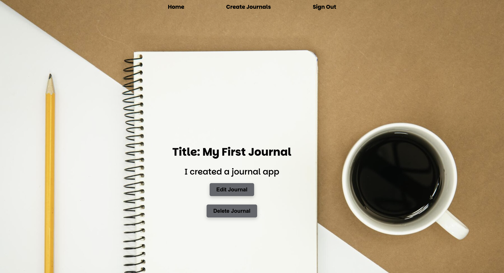

### My Diaries

### User Stories

AAU I should be able to sign up and sign in to a secure web app to create Journals.
AAU I should be able to read, update and delete the Journals I have created.
AAU I should be able to sign out of my profile.

### Description
For this project I wanted to create an app that uses full CRUD. I thought a journal app would be perfect for it, since it would allow users to create, read, update and delete the content they have created. Overall, My Diaries is an app where users can create an account and store journals.

### The User Interface

### Architechture
For the project I have used the work we've done in class and the labs as references to build my app. I have also used stock overflow, ClaudeAi as well as youtube tutorials to help me complete my project.

### Access:
GitHub: https://github.com/viededario/My_Diary

Deployed Link: https://my-diary-c1bc93453e57.herokuapp.com/